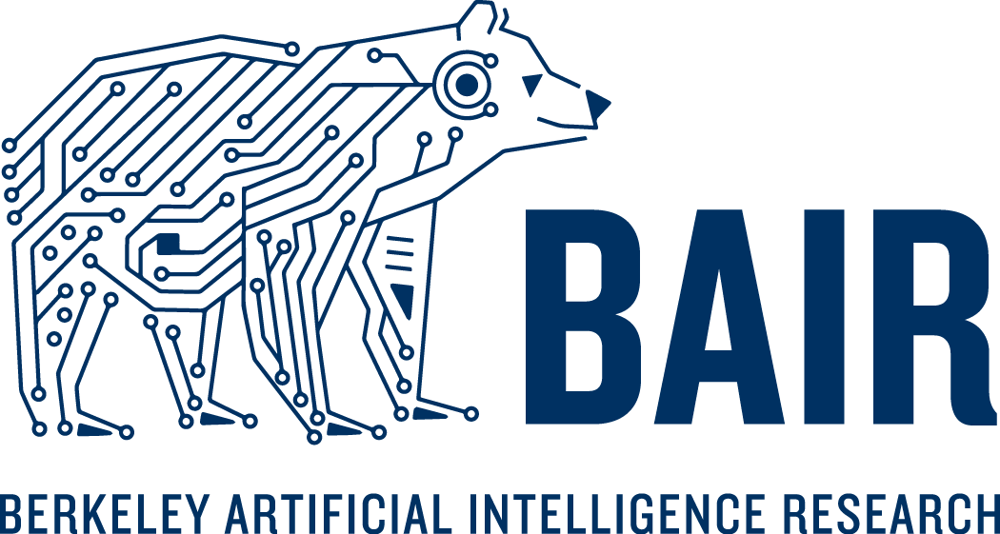
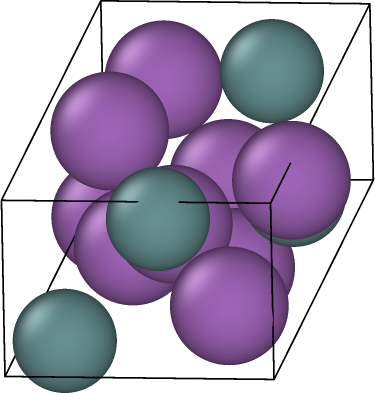

# Solving Offline Materials Optimization with CliqueFlowmer

Jakub Grudzien Kuba, Ben Kurt Miller, Sergey Levine, Pieter Abbeel

  

  <a href="https://arxiv.org/pdf/2603.06082">Paper</a>

---

## Overview

CliqueFlowmer is a domain-specific AI system for computational materials discovery that directly optimizes materials instead of only generating them.

It operates in three stages:

- Encode crystal structures into a latent representation  
- Optimize the latent space using evolution strategies  
- Decode optimized latents back into valid materials  

---

## Key Features

- Direct property optimization  
- Hybrid discrete-continuous modeling  
- Transformer + flow-based architecture  
- Clique-structured latent space  
- Fully offline optimization pipeline  

---

## Model Pipeline

  

---

## Example Outputs

  
  
  
  
  
  
  

---

## Repository Structure

models/
  cliqueflowmer.py   Main model (encoder + predictor + decoders)
  transformer.py     Transformer backbone
  flow.py            Geometry flow decoder

architectures/       Shared building blocks

optimization/
  learner.py         ES / gradient learners
  design.py          Optimization loop
  sun.py             Stability / uniqueness / novelty metrics

data/
  tools.py           Dataset + utilities
  constants.py       Atomic metadata

configs/
  mp20/              Default setup
  mp20-bandgap/      Band gap optimization

scripts/
  train.py           Distributed training
  optimize.py        Material discovery

---

## Setup

### Environment

python -m venv .venv
source .venv/bin/activate
pip install -U pip
pip install -r requirements.txt

---

### Storage and Logging

- Create a Weights & Biases account  
- Create a Google Cloud bucket  
- Upload data to:
  CliqueFlowmer/data/preprocessed/<task_name>

- Prepare model storage:
  CliqueFlowmer/models/states/<model_name>/<task_name>

---

## Training

CUDA_VISIBLE_DEVICES=0,1,2,3,4,5,6,7 \
torchrun \
  --nproc_per_node=8 \
  --nnodes=1 \
  --node_rank=0 \
  --master_addr=localhost \
  --master_port=12346 \
  train.py

---

## Material Discovery

CUDA_VISIBLE_DEVICES=0,1,2,3,4,5,6,7 \
python optimize.py

---

## Citation

@article{grudzien2026cliqueflowmer,
  title={Offline Materials Optimization with CliqueFlowmer},
  author={Grudzien Kuba, Jakub and Miller, Benjamin Kurt and Levine, Sergey and Abbeel, Pieter},
  year={2026}
}